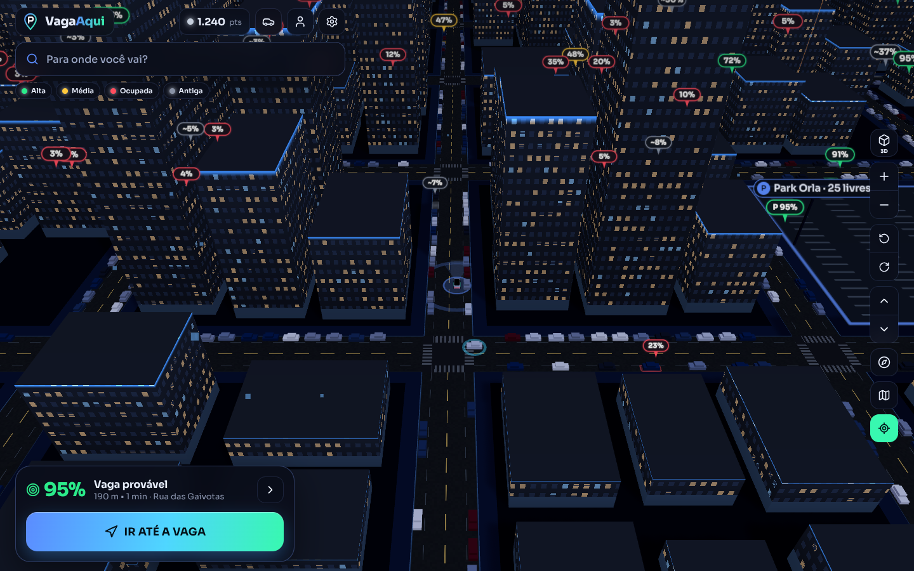
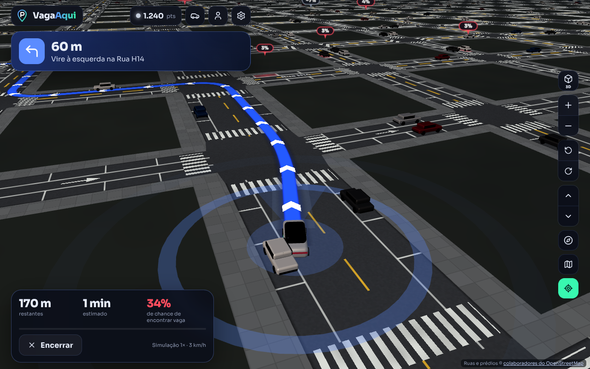
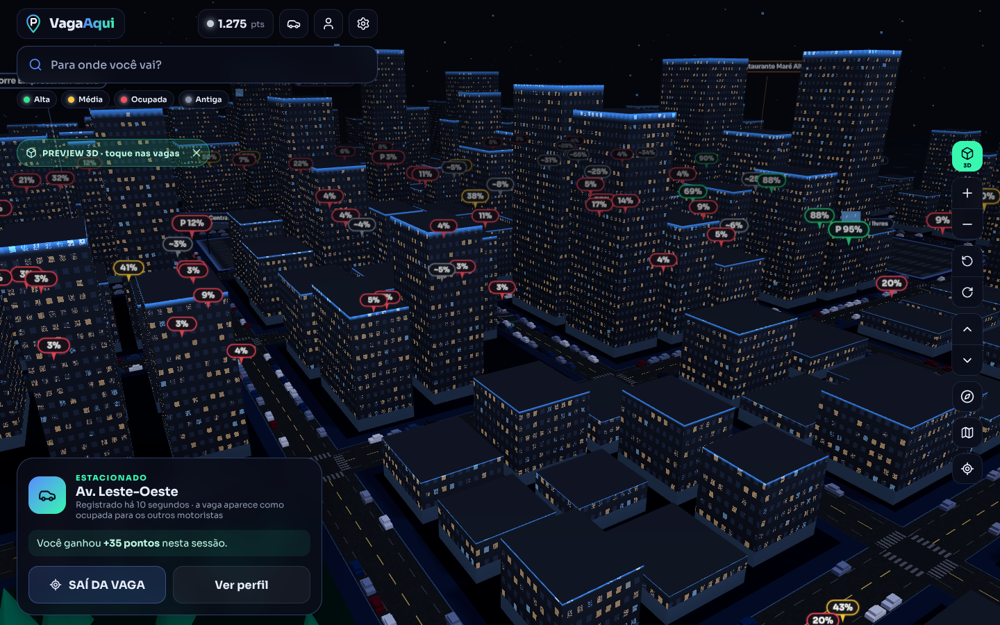
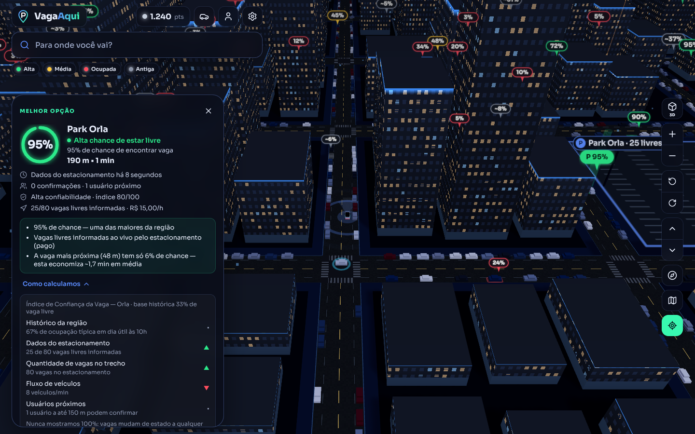
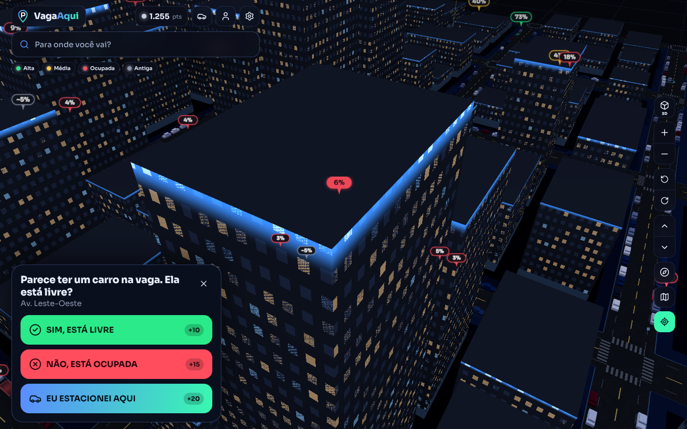
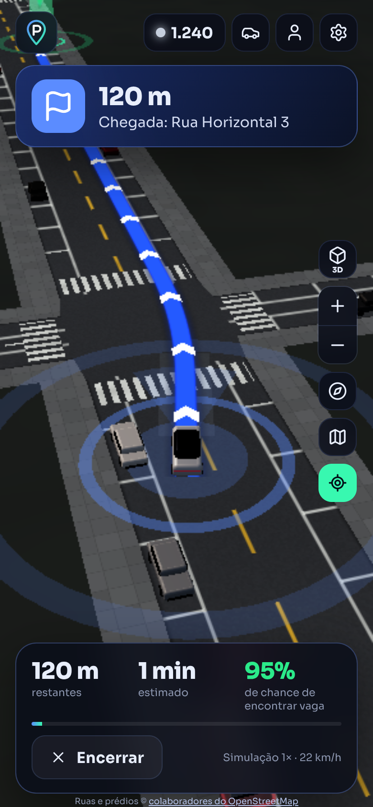

# VagaAqui

> Encontre sua vaga antes de chegar.

MVP web 3D que mostra onde há **maior probabilidade** de existir vaga de estacionamento, escolhe a melhor opção (não a mais próxima) e guia o motorista até ela, com confirmações colaborativas e recompensas.

| Mapa | Navegação | Visão geral |
| --- | --- | --- |
|  |  |  |
| **Índice de Confiança** | **Chegada e confirmação** | **Celular** |
|  |  |  |

**Stack:** React 19 · TypeScript · Vite · Three.js · React Three Fiber · @react-three/drei · GSAP · Lucide React.

## Rodando

```bash
cd vagaaqui
npm install
npm run dev        # http://localhost:5173
npm test           # 36 testes: Índice de Confiança, recomendação, rotas, importador OSM, simulação, geometria
npm run build      # typecheck + build de produção em dist/
npm run import-osm # grava um snapshot das ruas reais em public/osm/area.json (opcional)
npm run sensor-report -- log.json  # resume um log do sensor de câmera e gera CSV para conferência
```

Nenhuma chave de API é necessária. Variáveis opcionais estão em `.env.example` (copie para `.env.local`):

| Variável | Para quê |
| --- | --- |
| `VITE_API_URL` | URL do backend real. Vazio = repositório mock local (perfil salvo no navegador). |
| `VITE_MAP_CENTER_LAT` / `VITE_MAP_CENTER_LON` | Centro da área do mapa (padrão: -20.329, -40.292, Grande Vitória-ES). |
| `VITE_OSM_RADIUS_M` | Raio (m) da área baixada do OpenStreetMap (padrão 650). |
| `VITE_MAP_SOURCE` | `osm` (padrão, ruas reais) ou `procedural` (cidade fictícia de demonstração). |
| `VITE_DETECTOR_MODEL_URL` / `VITE_MEDIAPIPE_WASM_URL` | Opcional: hospedar o modelo e o WebAssembly do sensor de câmera em servidor próprio. |
| `VITE_USE_BROWSER_GPS` | `true` liga o GPS contínuo ao abrir o mapa (também dá para ligar em Configurações). |

## Jornada demonstrada

Abrir app → animação do logo → **ENCONTRAR VAGA** → mapa aparece → ver localização → explorar (Preview 3D) → vagas com % → **MELHOR OPÇÃO** com motivos → **IR ATÉ A VAGA** → câmera de GPS segue o carro, rota animada no chão, manobras e voz → pergunta "Você viu uma vaga aqui?" ao passar → chegada: **SIM, ESTÁ LIVRE / NÃO, ESTÁ OCUPADA / EU ESTACIONEI AQUI** → vaga vira 🔴 "confirmada há 5 s" → pontos, nível, precisão → **SAÍ DA VAGA** libera a vaga para os outros.

Se a vaga estiver ocupada na chegada, o app agradece, dá os pontos e já recalcula a próxima melhor opção.

## Localização em tempo real (GPS)

Em **Configurações → Localização em tempo real** (ou com `VITE_USE_BROWSER_GPS=true`), o carro do app passa a seguir o GPS do aparelho:

- **Movimento do carro:** a posição é suavizada entre leituras e projetada na rota. Se você ficar mais de 4 s a mais de 35 m da rota, ela é recalculada sozinha.
- **Velocidade e direção:** quando o aparelho não informa (muitos não informam), são calculadas pelas leituras consecutivas.
- **Sinal fraco:** perder o sinal ou ficar parado não desliga o GPS. O indicador mostra "sinal fraco" e o carro fica no último ponto. Só uma permissão negada desliga.
- **Fora do mapa:** fora da área carregada, o app volta para o carro simulado e avisa.
- **Precisão:** o GPS de celular erra de 5 a 15 m na cidade. Ele mostra onde **você** está, mas não enxerga vagas.

## Modo de chegada

Nos últimos ~200 m, a câmera desce e se aproxima do carro, numa visão do entorno parecida com o painel de um carro moderno. Um aviso grande mostra **de que lado** está a vaga ("Vaga provável à direita · 40 m · 87%") e a voz anuncia uma vez. O Modo Motorista mostra o mesmo aviso em tamanho maior.

## Sensor de câmera (protótipo)

**Configurações → Sensor de câmera.** O celular preso no painel, com a câmera para a frente, vira um sensor de vagas:

1. **Detecção no aparelho:** o MediaPipe Object Detector (EfficientDet-Lite0, Apache 2.0) roda no próprio celular, por WebAssembly, em ~5 quadros por segundo. **Nenhuma imagem sai do aparelho.**
2. **Posição na rua:** cada veículo é posicionado no chão pela base da caixa, pela altura da câmera e pela linha do horizonte (modelo de rua plana), mais a posição e a direção do carro.
3. **Parado ou andando:** um rastreamento entre quadros mede a velocidade de cada veículo no chão. Quem anda a mais de 2,5 m/s é "em movimento" e não conta como estacionado.
4. **Votação por vaga:** cada vaga monitorada que passa no campo de visão (6 a 28 m) recebe votos ao longo de vários quadros. Só com o seu carro em movimento: num semáforo, o carro parado ao lado pareceria estacionado.
5. **Peso no índice:** o resultado vira observação "livre" ou "ocupada" com **no máximo 55% do peso** de uma confirmação humana. Só é enviado com **GPS real** dentro do mapa. No modo demonstração, as observações aparecem na tela, mas não entram no índice.

**Calibre antes de sair:** a linha tracejada precisa ficar sobre o horizonte da imagem. Nos testes, sem calibração, um carro a ~25 m foi estimado a 11 m.

**Como medir se funciona (antes de prometer o recurso):**
1. **Grave:** dirija com o sensor ligado e grave a tela ou um vídeo em paralelo.
2. **Exporte:** use **Exportar log** e depois rode `npm run sensor-report -- arquivo.json`. O script gera um CSV com cada observação, horário e posição.
3. **Confira:** marque na última coluna o que havia de verdade na rua. Precisão = acertos / total.

**Limitações conhecidas:** ladeiras, celular inclinado, entradas de garagem, faixas onde é proibido estacionar, chuva e noite. O detector reconhece **veículos**, não "vaga válida". Para o modelo de 4,6 MB, o primeiro uso precisa de internet. O backend de GPU do MediaPipe deu zero detecções numa GPU emulada nos testes, então o padrão é CPU. Para usar GPU: `localStorage['vagaaqui.detector.delegate'] = 'GPU'`.

## Mapa 2D leve (padrão) e mapa 3D (opcional)

O app abre no **mapa 2D leve** (Canvas 2D, sem WebGL), feito para rodar liso em celular simples. Mostra ruas, vagas com a chance, alguns carros, a rota e o seu carro, com o mapa girando conforme o rumo, como nos apps de navegação.

- **Tiles pré-desenhados** (`src/components/map2d/tiles.ts`): ruas, calçadas, faixas e carros parados são desenhados uma vez em imagens de 512 px por nível de zoom (índice espacial + cache LRU, no máximo 2 tiles novos por quadro). Enquanto um tile sai, aparece o nível mais grosso, que é desenhado para a cidade inteira na abertura, então o mapa nunca fica com buracos.
- **Por quadro** só se desenha o que muda: vagas coloridas, carros nas vagas monitoradas, trânsito, rota, etiquetas e o seu carro. Gasta ~2 ms de JavaScript por quadro.
- **Medido** (Chromium sem GPU, cidade grande de teste): **60 fps** no celular (390×844 @2x) e no desktop. O mapa 3D anterior dava 6 fps no mesmo cenário com GPU emulada.
- **Gestos:** 1 dedo arrasta, pinça dá zoom, 2 dedos giram; no desktop, roda do mouse dá zoom e botão direito gira.
- Os painéis não usam mais `backdrop-filter` (desfoque), que pesava em todo quadro no celular.

O mapa 3D continua disponível em **Configurações → Mapa → Mapa 3D**.

## Visual do mapa 3D

Estilo de mapa de navegação realista, **sem prédios por padrão**. O mapa mostra só ruas, vagas e alguns carros.

- **Asfalto e calçadas:** asfalto com granulação, manchas e desgaste; calçadas de concreto com juntas; cruzamentos recortados no formato das bocas das ruas.
- **Sinalização no padrão brasileiro:** linha amarela separando os sentidos (dupla contínua em vias largas, tracejada nas estreitas), linhas brancas tracejadas entre faixas do mesmo sentido, linha de bordo, setas nas vias de mão única e faixas de pedestres.
- **Vagas demarcadas no meio-fio:** os traços pintados ficam exatamente nas mesmas posições das vagas da simulação (há teste para isso). As vagas monitoradas aparecem coloridas entre carros estacionados.
- **Carros, nomes de ruas e áreas:** carros com carroceria, vidros e rodas; nomes das ruas pintados no chão, alinhados com a via; parques com árvores, praia, água e litoral.
- **Câmera no celular:** em tela vertical, a câmera de navegação se ajusta para o carro não ficar escondido atrás do painel inferior.

Os prédios 3D ainda existem: dá para ligar em **Configurações → Mapa → Prédios 3D**.

## Ruas reais (OpenStreetMap)

O mapa usa as **ruas, prédios, parques, praias, litoral e estacionamentos reais do OpenStreetMap** ao redor do centro configurado. Ordem de carregamento (`src/world/cityStore.ts`):

1. **Snapshot do projeto** `public/osm/area.json`, se existir (gerado por `npm run import-osm`). Recomendado para produção: não depende do Overpass, carrega rápido e é igual para todos.
2. **Cache do aparelho**, válido por 7 dias.
3. **Overpass API ao vivo**, direto do navegador, com 3 servidores alternativos.
4. Se tudo falhar: **cidade fictícia de demonstração**, com aviso na tela.

O importador (`src/world/osm/`) gera:

- **Malha dirigida**: mão única respeitada (`oneway=yes/-1`, rotatórias) nas rotas e no trânsito simulado. Trechos fora da maior componente fortemente conexa não recebem vagas, então toda vaga sugerida tem ida e volta.
- **Ruas curvas** com vértices simplificados (Douglas-Peucker, 1,2 m) e largura por classe da via, `lanes` ou `width`.
- **Vagas de meio-fio** nas vias residenciais, terciárias, secundárias e primárias. As tags `parking:*` / `parking:lane:*` do OSM são respeitadas quando existem.
- **Prédios** extrudados da planta real, com altura por `height` ou `building:levels` e **estimada** quando o OSM não informa (comum no Brasil).
- **Estacionamentos** (`amenity=parking`) com nome e `capacity` reais quando existem. As vagas livres "ao vivo" desses estacionamentos são simuladas.
- **Zonas** (orla, centro, comercial, residencial) inferidas pela distância ao litoral/praia, pela densidade de comércio e por `landuse`.

Snapshot quando o Overpass não está acessível na sua rede:

```bash
npm run import-osm -- --print-query > consulta.overpassql   # cole em https://overpass-turbo.eu
npm run import-osm -- --from-file export.json               # JSON "raw" exportado de lá
```

A atribuição "© colaboradores do OpenStreetMap", exigida pela licença ODbL, aparece no mapa.

## Como a probabilidade é calculada (Índice de Confiança da Vaga)

`src/domain/confidence.ts` — puro, testado e explicável na interface ("Como calculamos").

1. **Prior histórico** por zona, hora e dia útil/fim de semana (`historical.ts`).
2. **Cadeia de Markov livre⇄ocupada** coerente com esse histórico: a permanência média por zona define a velocidade com que uma informação "envelhece" (centro ≈ 2–3 min, bairro residencial ≈ horas).
3. **Confirmações** entram por **Bayes**, ponderadas pela precisão de quem confirmou. "Estacionei" e "saí da vaga" reiniciam o estado.
4. A crença é **projetada até o momento estimado de chegada** do motorista.
5. Ajustes: dados ao vivo de estacionamentos, oferta de vagas no trecho, motoristas lentos por perto (concorrência), fluxo de veículos.
6. Probabilidade sempre entre **3% e 95%**: o app nunca diz "100% livre".

A **confiabilidade** é separada da probabilidade: frescor da última confirmação, volume de confirmações, qualidade do histórico da zona e usuários próximos. Cores: 🟢 ≥ 65% · 🟡 35–64% · 🔴 < 35% · ⚪ confiabilidade baixa (informação antiga).

**Melhor vaga** (`recommendation.ts`): minimiza o tempo esperado = direção + caminhada até o destino + (1 − P ajustada pela confiabilidade) × custo de ter que procurar outra.

## Arquitetura

```
src/
  components/
    map2d/      Map2D (padrão), tiles, camera2d, layers
    map/        Map3D, City, Vehicle, ParkingSpot, ParkingSpotMarker, ParkingSpotsLayer,
                NavigationRoute, LocationIndicator, CameraRig, TrafficCars, ParkingLots,
                PointsOfInterest, Particles, shaders, geometries
    ui/         SearchBar, ConfidenceCard, BottomPanel, UserConfirmation, RewardSystem,
                UserProfile, Preview3D, NavigationControls, MapControls, DriverMode,
                SettingsPanel, TopBar
    splash/     SplashScreen
  domain/       confidence, historical, recommendation, rewards  (lógica pura + testes)
  world/        cityTypes (modelo de cidade), cityStore (carregamento), roadGraph (Dijkstra dirigido,
                rota, curvas suaves), osm/ (consulta Overpass, conversão, construção, fixture de teste),
                cityGenerator (cidade fictícia de reserva)
  simulation/   WorldSimulation (trânsito, verdade oculta, relatos de outros usuários)
  services/
    repository/   ParkingRepository → MockParkingRepository | HttpParkingRepository
    dataSources/  contrato ParkingDataSource + catálogo de fontes e suas limitações
    location/     GPS do navegador → coordenadas do mapa
    speech.ts     instruções por voz (Web Speech API)
  store/        appStore (useSyncExternalStore), cameraBus
  data/         mockSpots (vagas, estacionamentos, relatos iniciais)
```

### Conectar um backend real

1. Defina `VITE_API_URL`. `HttpParkingRepository` já chama `GET/PUT /me/profile` e `POST /reports`.
2. Substitua a leitura de vagas da `WorldSimulation` por `GET /spots?bbox=…` retornando `ParkingSpot[]` (mesmo formato de `src/types`). O Índice de Confiança roda igual no cliente ou no servidor.
3. A autenticação deve ser adicionada no `HttpParkingRepository` (nenhuma credencial fica no código).

### Fontes de dados (Configurações → Sistema de detecção)

Ativas na demonstração (simuladas): confirmações dos usuários e APIs de estacionamentos (contagem agregada). Preparadas, com as limitações reais documentadas: GPS (infere fluxo e "estacionou/saiu", **não vê vagas**), APIs de trânsito (velocidade das vias, **nenhuma API pública de mapas detecta vagas na rua**), sensores de solo e câmeras com visão computacional (só onde instalados, com LGPD).

## Performance

- Detecção de capacidade (núcleos, memória, GPU via `WEBGL_debug_renderer_info`, celular, movimento reduzido) → perfis Leve/Equilibrada/Máxima, ajustáveis em Configurações.
- Perfis reduzem prédios, carros estacionados, trânsito, partículas, estrelas, sombras, antialias e resolução; `PerformanceMonitor` baixa a resolução se o FPS cair.
- Prédios, ruas, carros e árvores são `InstancedMesh` (poucas draw calls); janelas são procedurais em shader (sem texturas).
- O bundle 3D (three + R3F + drei, ~258 kB gzip) só é baixado se o mapa 3D for escolhido; o mapa 2D é carregado com `React.lazy` durante a animação de abertura.

## Limitações honestas deste MVP

- **Qualidade do mapa = qualidade do OSM na região.** Alturas sem tag são estimadas, e sem tags `parking:*` as vagas de meio-fio vêm de uma heurística por tipo de via (pode marcar trechos onde estacionar é proibido).
- **O mar não é preenchido**: o OSM representa o oceano só como a linha de costa (desenhada em ciano), não como polígono.
- O download ao vivo do Overpass pesa alguns MB na primeira abertura e depende de um serviço público com limite de uso. Para produção, gere o snapshot.
- Vagas, ocupação, trânsito e outros usuários são **simulados**. A "precisão" do usuário é validada contra a verdade da simulação; em produção seria validação cruzada entre fontes.
- O carro do usuário é simulado (velocidade 1×/2×/4× em Configurações); o GPS real só posiciona o carro se você estiver dentro da área mapeada.
- O histórico de ocupação é uma tabela estimada, não dados medidos.
